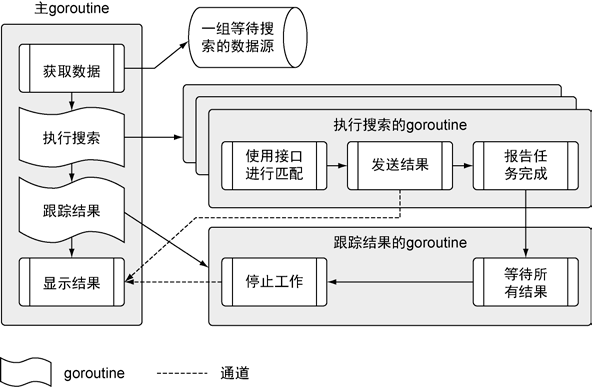

# GO语言实战 (GO IN ACTION)

### 序

Go 语言是由谷歌公司在 2007 年开始开发的一门语言，目的是能在多核心时代高效编写网络
应用程序。Go 语言的创始人 Robert Griesemer、Rob Pike 和 Ken Thompson 都是在计算机发展过程
中作出过重要贡献的人。自从 2009 年 11 月正式公开发布后，Go 语言迅速席卷了整个互联网后端
开发领域，其社区里不断涌现出类似 vitess、Docker、etcd、Consul 等重量级的开源项目。
在 Go 语言发布后，我就被其简洁、强大的特性所吸引，并于 2010 年开始在技术聚会上宣
传 Go 语言，当时所讲的题目是《Go 语言：互联网时代的 C》。现在看来，Go 语言确实很好地
解决了互联网时代开发的痛点，而且入门门槛不高，是一种上手容易、威力强大的工具。试想一
下，不需要学习复杂的异步逻辑，使用习惯的顺序方法，就能实现高性能的网络服务，并充分利
用系统的多个核心，这是多么美好的一件事情。

在计算机科学领域，提到不同寻常的人，总会有一些名字会闪现在你的脑海中。Rob Pike、
Robert Griesmier 和 Ken Thompson 就是其中几个。他们 3 个人负责构建过 UNIX、Plan 9、B、Java
的 JVM HotSpot、V8、Strongtalk①、Sawzall、Ed、Acme 和 UTF8，此外还有很多其他的创造。
在 2007 年，这 3 个人凑在一起，尝试一个伟大的想法：综合他们多年的经验，借鉴已有的语言，
来创建一门与众不同的、全新的系统语言。他们随后以开源的形式发布了自己的实验成果，并将
这种语言命名为“Go”。如果按照现在的路线发展下去，这门语言将是这 3 个人最有影响的一项
创造。

当人们聚在一起，纯粹是为了让世界变得更好的时候，往往也是他们处于最佳状态的时候。
在 2013 年，为了围绕 Go 语言构建一个更好的社区，Brian 和 Erik 联合成立了 Gopher Academy，
没过多久，Bill 和其他一些有类似想法的人也加入迚来。他们首先注意到，社区需要有一个地方
可以在线聚集和分享素材，所以他们在 slack 创立了 Go 讨论版和 Gopher Academy 博客。随着时
间的推移，社区越来越大，他们创建了世界上第一个全球 Go 语言大会—GopherCon。随着与
社区更深入地交流，他们意识到还需要为广大想学习这门新语言的人提供一些资源，所以他们开
始着手写一本书，就是现在你手里拿的这本书。


为 Go 社区贡献了大量的时间和精力的 3 位作者，出于对 Go 语言社区的热爱写就了这本书。
我曾在 Bill、Brian 和 Erik 身边，见证了他们在不同的环境和角色（作为 Gopher Academy 博客的
编辑，作为大会组织者，甚至是在他们的日常工作中，作为父亲和丈夫）下，都会认真负责地撰
写和修订本书。对他们来说，这不仅仅是一本书，也是对他们心爱的语言的献礼。他们并不满足
于写就一本“好”书。他们编写、审校，再写、再修改，再三推敲每页文字、每个例子、每一章，
直到认为本书的内容配得上他们珍视的这门语言。

离开一门使用舒服、掌握熟练的语言，去学习一门不仅对自己来说，对整个世界来说都是全
新的语言，是需要勇气的。这是一条人迹罕至，沿途充满 bug，只有少数先行者熟悉的路。这里
充满了意外的错误，文档不明确或者缺失，而且缺少可以拿来即用的代码库。这是拓荒者、先锋
才会选择的道路。如果你正在读这本书，那么你可能正在踏上这段旅途。

本书自始至终是为你—本书的读者精心制作的一本探索、学习和使用 Go 语言的简洁而全
面的指导手册。在全世界，你也不会找到比 Bill、Brian 和 Erik 更好的导师了。我非常高兴你能
开始探索 Go 语言的优点，期望能在线上和线下大会上遇到你。

###前言
那是 2013 年 10 月，我刚刚花几个月的时间写完 GoingGo.net 博客，就接到了 Brian Ketelsen
和 Erik St. Martin 的电话。他们正在写这本书，问我是否有兴趣参与迚来。我立刻抓住机会，参
与到写作中。当时，作为一个 Go 语言的新手，这是我迚一步了解这门语言的好机会。毕竟，与
Brian 和 Erik 一起工作、一起分享获得的知识，比我从构建博客中学到的要多得多。

完成前 4 章后，我们在 Manning 早期访问项目（MEAP）中发布了这本书。很快，我们收到
了来自语言团队成员的邮件。这位成员对很多细节提供了评审意见，还附加了大量有用的知识、
意见、鼓励和支持。根据这些评审意见，我们决定从头开始重写第 2 章，并对第 4 章迚行了全面
修订。据我们所知，对整章迚行重写的情况并不少见。通过这段重写的经历，我们学会要依靠社
区的帮助来完成写作，因为我们希望能立刻得到社区的支持。

自那以后，这本书就成了社区努力的成果。我们投入了大量的时间研究每一章，开发样例代
码，并和社区一起评审、讨论并编辑书中的材料和代码。我们尽了最大的努力来保证本书在技术
上没有错误，让代码符合通用习惯，并且使用社区认为应该有的方式来教 Go 语言。同时，我们
也融入了自己的思考、自己的实践和自己的指导方式。

我们希望本书能帮你学习 Go 语言，不仅是当下，就是多年以后，你也能从本书中找到有用
的东西。Brian、Erik 和我总会在线上帮助那些希望得到我们帮助的人。如果你购买了本书，谢
谢你，来和我们打个招呼吧。

### 章节速览
#### 本书由 9 章组成，每章内容简要描述如下。
- 第 1 章快速介绍这门语言是什么，为什么要创造这门语言，以及这门语言要解决什么问题。这一章还会简要介绍一些 Go 语言的核心概念，如并发。
- 第 2 章引导你完成一个完整的 Go 程序，并教你 Go 作为一门编程语言必须提供的特性。
- 第 3 章介绍打包的概念，以及搭建 Go 工作空间和开发环境的最佳实践。这一章还会展示如何使用 Go 语言的工具链，包括获取和构建代码。
- 第 4 章展示 Go 语言内置的类型，即数组、切片和映射。还会解释这些数据结构背后的实现和机制。
- 第 5 章详细介绍 Go 语言的类型系统，从结构体类型到具名类型，再到接口和类型嵌套。这一章还会展示如何综合利用这些数据结构，用简单的方法来设计结构并编写复杂的软件。 
- 第 6 章深入展示 Go 调度器、并发和通道是如何工作的。这一章还将介绍这个方面背后的机制。
- 第 7 章基于第 6 章的内容，展示一些实际开发中用到的并发模式。你会学到为了控制任务如何实现一个 goroutine 池，以及如何利用池来复用资源。
- 第 8 章对标准库进行探索，深入介绍 3 个包，即 log、json 和 io。这一章专门介绍这3 个包之间的某些复杂关系。
- 第 9 章以如何利用测试和基准测试框架来结束全书。读者会学到如何写单元测试、表组测试以及基准测试，如何在文档中增加示例，以及如何把这些示例当作测试使用。

### 关于代码
本书中的所有代码都使用等宽字体表示，以便和周围的文字区分开。在很多代码清单中，代
码被注释是为了说明关键概念，并且有时在正文中会用数字编号来给出对应代码的其他信息。
本书的源代码既可以在 Manning 网站（www.manning.com/books/go-in-action）上下载，也
可以在 GitHub（https://github.com/goinaction/code）上找到这些源代码。

## 目录

- 第 1 章 关于 Go 语言的介绍
	- 1.1 用Go解决现代编程难题
	- 1.1.1 开发速度
	- 1.1.2 并发
	- 1.1.3 Go 语言的类型系统
	- 1.1.4 内存管理
	- 1.2 你好，Go
	- 1.3 小结 8 
- 第2章 快速开始一个Go程序
	- 2.1 程序架构
	- 2.2 main 包
	- 2.3 search 包
	- 2.3.1 search.go
	- 2.3.2 feed.go
	- 2.3.3 match.go/default.go
	- 2.4 RSS 匹配器
	- 2.5 小结
- 第 3 章 打包和工具链
	- 3.1 包
	- 3.1.1 包名惯例
	- 3.1.2 main 包
	- 3.2 导入
	- 3.2.1 远程导入
	- 3.2.2 命名导入
	- 3.3 函数 init
	- 3.4 使用 Go 的工具
	- 3.5 进一步介绍 Go 开发
	- 3.5.1 go vet
	- 3.5.2 Go 代码格式化
	- 3.5.3 Go 语言的文档
	- 3.6 与其他Go开发者合作
	- 3.7 依赖管理
	- 3.7.1 第三方依赖
	- 3.7.2 对 gb 的介绍
	- 3.8 小结
- 第 4 章 数组、切片和映射
	- 4.1 数组的内部实现和基础
	- 4.1.1 内部实现
	- 4.1.2 声明和初始化
	- 4.1.3 使用数组
	- 4.1.4 多维数组
	- 4.1.5 在函数间传递数组
	- 4.2 切片的内部实现和基础
	- 4.2.1 内部实现
	- 4.2.2 创建和初始化
	- 4.2.3 使用切片
	- 4.2.4 多维切片
	- 4.2.5 在函数间传递切片
	- 4.3 映射的内部实现和基础
	- 4.3.1 内部实现
	- 4.3.2 创建和初始化
	- 4.3.3 使用映射
	- 4.3.4 在函数间传递映射
	- 4.4 小结
- 第 5 章 Go 语言的类型系统
	- 5.1 用户定义的类型
	- 5.2 方法
	- 5.3 类型的本质
	- 5.3.1 内置类型
	- 5.3.2 引用类型
	- 5.3.3 结构类型
	- 5.4 接口
	- 5.4.1 标准库
	- 5.4.2 实现
	- 5.4.3 方法集
	- 5.4.4 多态
	- 5.5 嵌入类型
	- 5.6 公开或未公开的
	- 5.7 小结
- 第 6 章 并发
	- 6.1 并发与并行
	- 6.2 goroutine
	- 6.3 竞争状态
	- 6.4 锁住共享资源
	- 6.4.1 原子函数
	- 6.4.2 互斥锁
	- 6.5 通道
	- 6.5.1 无缓冲的通道
	- 6.5.2 有缓冲的通道
	- 6.6 小结
- 第 7 章 并发模式
	- 7.1 runner
	- 7.2 pool
	- 7.3 work
	- 7.4 小结
- 第 8 章 标准库
	- 8.1 文档与源代码
	- 8.2 记录日志
	- 8.2.1 log 包
	- 8.2.2 定制的日志记录器
	- 8.2.3 结论
	- 8.3 编码/解码
	- 8.3.1 解码 JSON
	- 8.3.2 编码 JSON
	- 8.3.3 结论
	- 8.4 输入和输出
	- 8.4.1 Writer 和 Reader 接口
	- 8.4.2 整合并完成工作
	- 8.4.3 简单的 curl
	- 8.4.4 结论
	- 8.5 小结
- 第 9 章 测试和性能
	- 9.1 单元测试
	- 9.1.1 基础单元测试
	- 9.1.2 表组测试
	- 9.1.3 模仿调用
	- 9.1.4 测试服务端点
	- 9.2 示例
	- 9.3 基准测试
	- 9.4 小结
	

## 第 1 章 关于 Go 语言的介绍
本章主要内容
- 用 Go 语言解决现代计算难题
- 使用 Go 语言工具

在本章中读者会看到  语言区别于其他编程语言的地方。 语言对传统的面向对象开发
进行了重新思考，并且提供了更高效的复用代码的手段。Go 语言还让用户能更高效地利用昂贵
服务器上的所有核心，而且它编译大型项目的速度也很快。

在阅读本章时，读者会对影响 Go 语言形态的很多决定有一些认识，从它的并发模型到快如
闪电的编译器。我们在前言中提到过，这里再强调一次：这本书是写给已经有一定其他编程语言
经验、想学习 Go 语言的中级开发者的。本书会提供一个专注、全面且符合习惯的视角。我们同
时专注语言的规范和实现，涉及的内容包括语法、Go 语言的[类型系统](#)、[并发](#)、[通道](#)、[测试](#)以及
其他一些非常广泛的主题。我们相信，对刚开始要学习 Go 语言和想要深入了解语言内部实现的
人来说，本书都是最佳选择。


### 1.1 用 Go 解决现代编程难题
    Go 语言开发团队花了很长时间来解决当今软件开发人员面对的问题。开发人员在为项目选
    择语言时，不得不在快速开发和性能之间做出选择。C 和 C++这类语言提供了很快的执行速度，
    而 Ruby 和 Python 这类语言则擅长快速开发。Go 语言在这两者间架起了桥梁，不仅提供了高性
    能的语言，同时也让开发更快速。
    
    在探索 Go 语言的过程中，读者会看到精心设计的特性以及简洁的语法。作为一门语言，Go
    不仅定义了能做什么，还定义了不能做什么。Go 语言的语法简洁到只有几个关键字，便于记忆。
    Go 语言的编译器速度非常快，有时甚至会让人感觉不到在编译。所以，Go 开发者能显著减少等
    待项目构建的时间。因为 Go 语言内置并发机制，所以不用被迫使用特定的线程库，就能让软件
    扩展，使用更多的资源。Go 语言的类型系统简单且高效，不需要为面向对象开发付出额外的心
    智，让开发者能专注于代码复用。Go 语言还自带垃圾回收器，不需要用户自己管理内存。让我
    们快速浏览一下这些关键特性。

#### 1.1.1 开发速度
    
#### 1.1.2 并发
    作为程序员，要开发出能充分利用硬件资源的应用程序是一件很难的事情。现代计算机都拥
    有多个核，但是大部分编程语言都没有有效的工具让程序可以轻易利用这些资源。这些语言需要
    写大量的线程同步代码来利用多个核，很容易导致错误。
    Go 语言对并发的支持是这门语言最重要的特性之一。goroutine 很像线程，但是它占用的
    内存远少于线程，使用它需要的代码更少。通道（channel）是一种内置的数据结构，可以让
    用户在不同的 goroutine 之间同步发送具有类型的消息。这让编程模型更倾向于在 goroutine
    之间发送消息，而不是让多个 goroutine 争夺同一个数据的使用权。让我们看看这些特性的
    细节。
    
- 1．goroutine
    - goroutine 是可以与其他 goroutine 并行执行的函数，同时也会与主程序（程序的入口）并行
      执行。在其他编程语言中，你需要用线程来完成同样的事情，而在 Go 语言中会使用同一个线程
      来执行多个 goroutine。例如，用户在写一个 Web 服务器，希望同时处理不同的 Web 请求，如果
      使用 C 或者 Java，不得不写大量的额外代码来使用线程。在 Go 语言中，net/http 库直接使用了
      内置的 goroutine。每个接收到的请求都自动在其自己的 goroutine 里处理。goroutine 使用的内存
      比线程更少，Go 语言运行时会自动在配置的一组逻辑处理器上调度执行 goroutine。每个逻辑处
      理器绑定到一个操作系统线程上（见图 1-2）。这让用户的应用程序执行效率更高，而开发工作量
      显著减少。
    
- 2．通道
    - 通道是一种数据结构，可以让 goroutine 之间进行安全的数据通信。通道可以帮用户避免其
      他语言里常见的共享内存访问的问题。
      并发的最难的部分就是要确保其他并发运行的进程、线程或 goroutine 不会意外修改用户的
      数据。当不同的线程在没有同步保护的情况下修改同一个数据时，总会发生灾难。在其他语言中，
      如果使用全局变量或者共享内存，必须使用复杂的锁规则来防止对同一个变量的不同步修改。
      为了解决这个问题，通道提供了一种新模式，从而保证并发修改时的数据安全。通道这一模
      式保证同一时刻只会有一个 goroutine 修改数据。通道用于在几个运行的 goroutine 之间发送数据。
      
      在图 1-3 中可以看到数据是如何流动的示例。想象一个应用程序，有多个进程需要顺序读取或者
      修改某个数据，使用 goroutine 和通道，可以为这个过程建立安全的模型。
      
      图 1-3 中有 3 个 goroutine，还有 2 个不带缓存的通道。第一个 goroutine 通过通道把数
      据传给已经在等待的第二个 goroutine。在两个 goroutine 间传输数据是同步的，一旦传输完
      成，两个 goroutine 都会知道数据已经完成传输。当第二个 goroutine 利用这个数据完成其任
      务后，将这个数据传给第三个正在等待的 goroutine。这次传输依旧是同步的，两个 goroutine
      都会确认数据传输完成。这种在 goroutine 之间安全传输数据的方法不需要任何锁或者同步
      机制。
      
      需要强调的是，通道并不提供跨 goroutine 的数据访问保护机制。如果通过通道传输数据的
      一份副本，那么每个 goroutine 都持有一份副本，各自对自己的副本做修改是安全的。当传输的
      是指向数据的指针时，如果读和写是由不同的 goroutine 完成的，每个 goroutine 依旧需要额外的
      同步动作。
      
#### 1.1.3 Go 语言的类型系统
    Go 语言提供了灵活的、无继承的类型系统，无需降低运行性能就能最大程度上复用代码。
    这个类型系统依然支持面向对象开发，但避免了传统面向对象的问题。如果你曾经在复杂的 Java
    和 C++程序上花数周时间考虑如何抽象类和接口，你就能意识到 Go 语言的类型系统有多么简单。
    Go 开发者使用组合（composition）设计模式，只需简单地将一个类型嵌入到另一个类型，就能
    复用所有的功能。其他语言也能使用组合，但是不得不和继承绑在一起使用，结果使整个用法非
    常复杂，很难使用。在 Go 语言中，一个类型由其他更微小的类型组合而成，避免了传统的基于
    继承的模型。
    另外，Go 语言还具有独特的接口实现机制，允许用户对行为进行建模，而不是对类型进行
    建模。在 Go 语言中，不需要声明某个类型实现了某个接口，编译器会判断一个类型的实例是否
    符合正在使用的接口。Go 标准库里的很多接口都非常简单，只开放几个函数。从实践上讲，尤
    其对那些使用类似 Java 的面向对象语言的人来说，需要一些时间才能习惯这个特性。
    
- 1．类型简单
    - Go 语言不仅有类似 int 和 string 这样的内置类型，还支持用户定义的类型。在 Go 语言
      中，用户定义的类型通常包含一组带类型的字段，用于存储数据。Go 语言的用户定义的类型看
      起来和 C 语言的结构很像，用起来也很相似。不过 Go 语言的类型可以声明操作该类型数据的方
      法。传统语言使用继承来扩展结构——Client 继承自 User，User 继承自 Entity，Go 语言与此不同，
      Go 开发者构建更小的类型——Customer 和 Admin，然后把这些小类型组合成更大的类型。图 1-4
      展示了继承和组合之间的不同。
      
- 2．Go 接口对一组行为建模
    - 接口用于描述类型的行为。如果一个类型的实例实现了一个接口，意味着这个实例可以执行
      一组特定的行为。你甚至不需要去声明这个实例实现某个接口，只需要实现这组行为就好。其他
      的语言把这个特性叫作鸭子类型——如果它叫起来像鸭子，那它就可能是只鸭子。Go 语言的接
      口也是这么做的。在 Go 语言中，如果一个类型实现了一个接口的所有方法，那么这个类型的实
      例就可以存储在这个接口类型的实例中，不需要额外声明。
    
#### 1.1.4 内存管理
    不当的内存管理会导致程序崩溃或者内存泄漏，甚至让整个操作系统崩溃。Go 语言拥有现
    代化的垃圾回收机制，能帮你解决这个难题。在其他系统语言（如 C 或者 C++）中，使用内存
    前要先分配这段内存，而且使用完毕后要将其释放掉。哪怕只做错了一件事，都可能导致程序崩
    溃或者内存泄漏。可惜，追踪内存是否还被使用本身就是十分艰难的事情，而要想支持多线程和
    高并发，更是让这件事难上加难。虽然 Go 语言的垃圾回收会有一些额外的开销，但是编程时，
    能显著降低开发难度。Go 语言把无趣的内存管理交给专业的编译器去做，而让程序员专注于更
    有趣的事情。


### 1.2 Hello Go
```go
package main
import "fmt" 

func main() { 
    fmt.Println("Hello world!")
}
```

### 1.3 小结
- Go 语言是现代的、快速的，带有一个强大的标准库。
- Go 语言内置对并发的支持。
- Go 语言使用接口作为代码复用的基础模块。


## 第2章 快速开始一个Go程序
本章主要内容
- 学习如何写一个复杂的 Go 程序
- 声明类型、变量、函数和方法
- 启动并同步操作 goroutine
- 使用接口写通用的代码
- 处理程序逻辑和错误

为了能更高效地使用语言进行编码，Go 语言有自己的哲学和编程习惯。Go 语言的设计者们
从编程效率出发设计了这门语言，但又不会丢掉访问底层程序结构的能力。设计者们通过一组最
少的关键字、内置的方法和语法，最终平衡了这两方面。Go 语言也提供了完善的标准库。标准
库提供了构建实际的基于 Web 和基于网络的程序所需的所有核心库。
让我们通过一个完整的 Go 语言程序，来看看 Go 语言是如何实现这些功能的。这个程序实
现的功能很常见，能在很多现在开发的 Go 程序里发现类似的功能。这个程序从不同的数据源拉
取数据，将数据内容与一组搜索项做对比，然后将匹配的内容显示在终端窗口。这个程序会读取
文本文件，进行网络调用，解码 XML 和 JSON 成为结构化类型数据，并且利用 Go 语言的并发
机制保证这些操作的速度。
读者可以下载本章的代码，用自己喜欢的编辑器阅读。代码存放在这个代码库：

```http
https://github.com/goinaction/code/tree/master/chapter2/sample
```

没必要第一次就读懂本章的所有内容，可以多读两遍。在学习时，虽然很多现代语言的概念
可以对应到 Go 语言中，Go 语言还是有一些独特的特性和风格。如果放下已经熟悉的编程语言，
用一种全新的眼光来审视 Go 语言，你会更容易理解并接受 Go 语言的特性，发现 Go 语言的优雅。

### 2.1 程序架构



- 这个程序分成多个不同步骤，在多个不同的 goroutine 里运行。我们会根据流程展示代码，
从主 goroutine 开始，一直到执行搜索的 goroutine 和跟踪结果的 goroutine，最后回到主 goroutine。
首先来看一下整个项目的结构。


- 项目的结构
```
- sample
- data
    data.json -- 包含一组数据源
 - matchers
    rss.go -- 搜索 rss 源的匹配器
 - search
    default.go -- 搜索数据用的默认匹配器
    feed.go -- 用于读取 json 数据文件
    match.go -- 用于支持不同匹配器的接口
    search.go -- 执行搜索的主控制逻辑
    main.go -- 程序的入口
```


- 这个应用的代码使用了 4 个文件夹，按字母顺序列出。
- 文件夹 data 中有一个 JSON 文档，其内容是程序要拉取和处理的数据源。
- 文件夹 matchers 中包含程序里用于支持搜索不同数据源的代码。
- 目前程序只完成了支持处理 RSS 类型的数据源的匹配器。
- 文件夹 search 中包含使用不同匹配器进行搜索的业务逻辑。
- 最后，父级文件夹 sample 中有个 main.go 文件，这是整个程序的入口。


### 2.2 main 包
```go
package sample

import (
	"log"
	_ "matchers"
	"os"
	"search"
)

// init 在main 之前调用
func init() {
	// 将日记输出到标准输出
	log.SetOutput(os.Stdout)
}

// main 是整个程序的入口
func main() {
	// 使用特定的项做搜索
	search.Run("president")
}
```


每个可执行的 Go 程序都有两个明显的特征。一个特征是第 18 行声明的名为 main 的函数。
构建程序在构建可执行文件时，需要找到这个已经声明的 main 函数，把它作为程序的入口。第
二个特征是程序的第 01 行的包名 main


可以看到，main 函数保存在名为 main 的包里。如果 main 函数不在 main 包里，构建工
具就不会生成可执行的文件。


Go 语言的每个代码文件都属于一个包，main.go 也不例外。
现在，只要简单了解以下内容：
- 一个包定义一组编译过的代码，包的名字类似命名空间，可以用来间接访问包内声明的标识符。
- 这个特性可以把不同包中定义的同名标识符区别开。


关键字 import 就是导入一段代码，让用户可以访问其中的标识符，如类型、函数、常量和接口。

- 在这个例子中，由于第 08 行的导入，main.go 里的代码就可以引用 search包里的 Run 函数。
- 程序的第 04 行和第 05 行导入标准库里的 log 和 os 包。
- 所有处于同一个文件夹里的代码文件，必须使用同一个包名。按照惯例，包和文件夹同名。
- 就像之前说的，一个包定义一组编译后的代码，每段代码都描述包的一部分。


这个技术是为了让 Go 语言对包做初始化操作，但是并不使用包里的标识符。
为了让程序的可读性更强，Go 编译器不允许声明导入某个包却不使用。
下划线让编译器接受这类导入，并且调用对应包内的所有代码文件里定义的 init 函数。
对这个程序来说，这样做的目的是调用matchers 包中的 rss.go 代码文件里的 init 函数，注册 RSS 匹配器，以便后用。
```go
package sample
import _ "matchers"
```


程序中每个代码文件里的 init 函数都会在 main 函数执行前调用。
这个 init 函数将标准库里日志类的输出，从默认的标准错误（Stderr），设置为标准输出（Stdout）设备。
```go
package sample
import (
    "log"
    "os"
)
// init 在main 之前调用
func init() {
	// 将日记输出到标准输出
	log.SetOutput(os.Stdout)
}
```

这一行调用了 search 包里的 Run 函数。这个函数包含程序的核心业务逻辑，需要传入一个字符串作为搜索项。一旦 Run 函数退出，程序就会终止。
```go
package sample
import "search"

// main 是整个程序的入口
func main() {
	// 使用特定的项做搜索
	search.Run("president")
}
```

### 2.3 search 包

    这个程序使用的框架和业务逻辑都在 search 包里。这个包由 4 个不同的代码文件组成，
    每个文件对应一个独立的职责。我们会逐步分析这个程序的逻辑，到时再说明各个代码文件的
    作用。
    
    由于整个程序都围绕匹配器来运作，我们先简单介绍一下什么是匹配器。这个程序里的匹配
    器，是指包含特定信息、用于处理某类数据源的实例。在这个示例程序中有两个匹配器。框架本
    身实现了一个无法获取任何信息的默认匹配器，而在 matchers 包里实现了 RSS 匹配器。RSS
    匹配器知道如何获取、读入并查找 RSS 数据源。随后我们会扩展这个程序，加入能读取 JSON
    文档或 CSV 文件的匹配器。我们后面会再讨论如何实现匹配器。


```go
package search

import (
	"log"
	"sync"
)

// TODO >> 创建一个 Matcher 的映射 （map）
// A map of registered matchers for searching
var matchers = make(map[string]Matcher)
```
    
- 可以看到，每个代码文件都以 package 关键字开头，随后跟着包的名字。
- 文件夹 search 下的每个代码文件都使用 search 作为包名。
- 第 03 行到第 06 行代码导入标准库的 log 和 sync 包。
- 与第三方包不同，从标准库中导入代码时，只需要给出要导入的包名。
- 编译器查找包的时候，总是会到 GOROOT 和 GOPATH 环境变量引用的位置去查找。

```shell script
GOROOT="/usr/local/go"
GOPATH="~/goCode"
```

- log 包提供打印日志信息到标准输出（stdout）、标准错误（stderr）或者自定义设备的功能。
- sync 包提供同步 goroutine 的功能。这个示例程序需要用到同步功能。
- 第 09 行是全书第一次声明一个变量，如代码清单 2-10 所示。


这个变量没有定义在任何函数作用域内，所以会被当成包级变量。
这个变量使用关键字 var声明，而且声明为 Matcher 类型的映射（map），这个映射以 string 类型值作为键，Matcher类型值作为映射后的值。
Matcher 类型在代码文件 matcher.go 中声明，后面再讲这个类型的用途。
这个变量声明还有一个地方要强调一下：变量名 matchers 是以小写字母开头的。

在 Go 语言里，标识符要么从包里公开，要么不从包里公开。
当代码导入了一个包时，程序可以直接访问这个包中任意一个公开的标识符。
这些标识符以大写字母开头。以小写字母开头的标识符是不公开的，不能被其他包中的代码直接访问。
但是，其他包可以间接访问不公开的标识符。
例如，一个函数可以返回一个未公开类型的值，那么这个函数的任何调用者，哪怕调用者不是在这个包里声明的，都可以访问这个值。


```go
    var matchers = make(map[string]Matcher)
```

#### map 是 Go 语言里的一个引用类型，需要使用 make 来构造。
- 如果不先构造 map 并将构造后的值赋值给变量，会在试图使用这个 map 变量时收到出错信息。
- 这是因为 map 变量默认的零值
- 是 nil。在第 4 章我们会进一步了解关于映射的细节。
- 在 Go 语言中，所有变量都被初始化为其零值。
- 对于数值类型，零值是 0；
- 对于字符串类型，零值是空字符串；
- 对于布尔类型，零值是 false；
- 对于指针，零值是 nil。
- 对于引用类型来说，所引用的底层数据结构会被初始化为对应的零值。
- 但是被声明为其零值的引用类型的变量，会返回 nil 作为其值。


### Run 函数包括了这个程序最主要的控制逻辑。这段代码很好地展示了如何组织 Go 程序的代码，以便正确地并发启动和同步 goroutine。
#### Go 语言使用关键字 func 声明函数，关键字后面紧跟着函数名、参数以及返回值。
- 对于 Run 这个函数来说，只有一个参数，是 string 类型的，名叫 searchTerm。
- 这个参数是 Run 函数要搜索的搜索项，如果回头看看 main 函数（如代码清单 2-14 所示），可以看到如何传递这个搜索项。
```
 func Run(searchTerm string)
```
- Run 函数做的第一件事情就是获取数据源 feeds 列表。这些数据源从互联网上抓取数据，之后对数据使用特定的搜索项进行匹配。

#### 调用了 search 包的 RetrieveFeeds 函数。
这个函数返回两个值。
- 第一个返回值是一组 Feed 类型的切片。
- 切片是一种实现了一个动态数组的引用类型。在 Go 语言里可以用切片来操作一组数据。


- 第二个返回值是一个错误值。在第 15 行，检查返回的值是不是真的是一个错误。
- 如果真的发生错误了，就会调用 log 包里的 Fatal 函数。Fatal 函数接受这个错误的值，并将这个错误在终端窗口里输出，随后终止程序。
- 不仅仅是Go语言，很多语言都允许一个函数返回多个值。
- 一般会像RetrieveFeeds函数这样声明一个函数返回一个值和一个错误值。

```go
	// TODO >> 获取需要搜索的数据源列表
	// TODO >> 调用了 search 包的 RetrieveFeeds 函数，这个函数返回两个值。第一个返回值是一组 Feed 类型的切片。
	// TODO >> 切片是一种实现了一个动态数组的引用类型。在 Go 语言里可以用切片来操作一组数据。
	feeds, err := RetrieveFeeds()
	if err != nil {
		log.Fatal(err)
	}
```

#### 这里可以看到简化变量声明运算符（:=）。
- 这个运算符用于声明一个变量，同时给这个变量赋予初始值。
- 编译器使用函数返回值的类型来确定每个变量的类型。
- 简化变量声明运算符只是一种简化记法，让代码可读性更高。
- 这个运算符声明的变量和其他使用关键字 var 声明的变量没有任何区别。

#### 我们使用内置的 make 函数创建了一个无缓冲的通道。
- 我们使用简化变量声明运算符，在调用 make 的同时声明并初始化该通道变量。
- 根据经验，如果需要声明初始值为零值的变量，应该使用 var 关键字声明变量；
- 如果提供确切的非零值初始化变量或者使用函数返回值创建变量，应该使用简化变量声明运算符 （:=）。
- 在 Go 语言中，通道（channel）和映射（map）与切片（slice）一样，也是引用类型，不过通道本身实现的是一组带类型的值，这组值用于在 goroutine 之间传递数据。
- 通道内置同步机制，从而保证通信安全。
```go
// 创建一个无缓冲的通道，接收匹配后的结果
reults := nake(chan *Reults)
```

#### Go 语言中，如果 main 函数返回，整个程序也就终止了。
Go 程序终止时，还会关闭所有之前启动且还在运行的 goroutine。
写并发程序的时候，最佳做法是，在 main 函数返回前，清理并终止所有之前启动的 goroutine。
编写启动和终止时的状态都很清晰的程序，有助减少 bug，防止资源异常。
这个程序使用 sync 包的 WaitGroup 跟踪所有启动的 goroutine。
非常推荐使用 WaitGroup 来跟踪 goroutine 的工作是否完成。
WaitGroup 是一个计数信号量，我们可以利用它来统计所有的 goroutine 是不是都完成了工作。

在第 23 行我们声明了一个 sync 包里的 WaitGroup 类型的变量。
之后在第 27 行，我们将 WaitGroup 变量的值设置为将要启动的 goroutine 的数量。
马上就能看到，我们为每个数据源都启动了一个 goroutine 来处理数据。
每个 goroutine 完成其工作后，就会递减 WaitGroup 变量的计数值，当这个值递减到 0 时，我们就知道所有的工作都做完了。

```go
    
    // TODO >> 构建一个 waitGroup 以便处理所有的数据源 
    //TODO >> 这个程序使用 sync 包的 WaitGroup 跟踪所有启动的 goroutine。
    // TODO >> 非常推荐使用 WaitGroup 来 跟踪 goroutine 的工作是否完成。
    // TODO >>WaitGroup 是一个计数信号量，我们可以利用它来统计所有的 goroutine 是不是都完成了工作。
    // setup await group so we can process all the feeds
    var waitGroup sync.WaitGroup


    // TODO >> 设置需要等待处理 每个数据源的 goroutines 的数量
    // TODO >> 我们将 WaitGroup 变量的值设置为将要启动的 goroutine 的数量
    // TODO >> 马上就能看到，我们为每个数据源都启动了一个 goroutine 来处理数据
    // TODO >> 每个 goroutine 完成其工作后，就会递减 WaitGroup 变量的计数值
    // set the number of go routines we need to wait for while
    // they process the individual feeds
    waitGroup.Add(len(feeds))
```


### 使用关键字 for range 对 feeds 切片做迭代。
- 关键字 range 可以用于迭代数组、字符串、切片、映射和通道。
- 使用 for range 迭代切片时，每次迭代会返回两个值。
- 第一个值是迭代的元素在切片里的索引位置，第二个值是元素值的一个副本。

这是第二次看到使用了下划线标识符。第一次是在 main.go 里导入 matchers 包的时候。这
次，

- 下划线标识符的作用是占位符，占据了保存 range 调用返回的索引值的变量的位置。
- 如果要调用的函数返回多个值，而又不需要其中的某个值，就可以使用下划线标识符将其忽略。
- 在我们的例子里，我们不需要使用返回的索引值，所以就使用下划线标识符把它忽略掉。


### 检查 map 是否含有符合数据源类型的值。
- 查找 map 里的键时，有两个选择：要么赋值给一个变量，要么为了精确查找，赋值给两个变量。
- 赋值给两个变量时第一个值和赋值给一个变量时的值一样，是 map 查找的结果值。
- 如果指定了第二个值，就会返回一个布尔标志，来表示查找的键是否存在于 map 里。
- 如果这个键不存在，map 会返回其值类型的零值作为返回值，如果这个键存在，map 会返回键所对应值的副本。

### goroutine 是一个独立于其他函数运行的函数。
- 使用关键字 go 启动一个 goroutine，并对这个 goroutine 做并发调度。
- 我们使用关键字 go 启动了一个匿名函数作为 goroutine。
- 匿名函数是指没有明确声明名字的函数。在 for range 循环里，我们为每个数据源，以 goroutine 的方式启动了一个匿名函数。
- 这样可以并发地独立处理每个数据源的数据。
- 匿名函数也可以接受声明时指定的参数。
- 我们指定匿名函数要接受两个参数，一个类型为 Matcher，另一个是指向一个 Feed 类型值的指针。
- 这意味着变量 feed 是一个指针变量。指针变量可以方便地在函数之间共享数据。
- 使用指针变量可以让函数访问并修改一个变量的状态，而这个变量可以在其他函数甚至是其他 goroutine 的作用域里声明。
- 在 Go 语言中，所有的变量都以值的方式传递。
- 因为指针变量的值是所指向的内存地址，在函数间传递指针变量，是在传递这个地址值，所以依旧被看作以值的方式在传递。

- goroutine 做的第一件事是调用一个叫 Match 的函数，这个函数可以在 match.go 文件里找到。
- Match 函数的参数是一个 Matcher 类型的值、一个指向 Feed 类型值的指针、搜索项以及输出结果的通道。
- Match 函数会搜索数据源的数据，并将匹配结果输出到 results 通道。

- 一旦 Match 函数调用完毕，就会执行递减 WaitGroup 的计数。
- 一旦每个goroutine 都执行调用 Match 函数和 Done 方法，程序就知道每个数据源都处理完成。

- 调用 Done 方法这一行还有一个值得注意的细节：WaitGroup 的值没有作为参数传入匿名函数，但是匿名函数依旧访问到了这个值。
- Go 语言支持闭包，这里就应用了闭包。实际上，在匿名函数内访问 searchTerm 和 results 变量，也是通过闭包的形式访问的。
- 因为有了闭包，函数可以直接访问到那些没有作为参数传入的变量。
- 匿名函数并没有拿到这些变量的副本，而是直接访问外层函数作用域中声明的这些变量本身。
- 因为 matcher 和 feed 变量每次调用时值不相同，所以并没有使用闭包的方式访问这两个变量。

- 变量 feed 和 matcher 的值会随着循环的迭代而改变。
- 如果我们使用闭包访问这些变量，随着外层函数里变量值的改变，内层的匿名函数也会感知到这些改变。
- 所有的 goroutine 都会因为闭包共享同样的变量。
- 除非我们以函数参数的形式传值给函数，否则绝大部分 goroutine 最终都会使用同一个 matcher 来处理同一个 feed——这个值很有可能是 feeds 切片的最后一个值。
- 随着每个 goroutine 搜索工作的运行，将结果发送到 results 通道，并递减 waitGroup 的计数，我们需要一种方法来显示所有的结果，并让 main 函数持续工作，直到完成所有的操作。

```go
	// TODO >> 我们为每个数据源启动一个 goroutines 来查找结果（处理数据）
	// TODO >> 使用关键字 for range 对 feeds 切片做迭代
	// TODO >> 使用 for range 迭代切片时，每次迭代会返回两个值。第一个值是迭代的元素在切片里的索引位置，第二个值是元素值的一个副本
	// TODO >> 下划线标识符的作用是占位符，占据了保存 range 调用返回的索引值的变量的位置。如果要调用的函数返回多个值，而又不需要其中的某个值，就可以使用下划线标识符将其忽略。
	for _, feed := range feeds {
		// TODO >> 获取一个匹配器用于查找
		// TODO >> 查找 map 里的键时，有两个选择：要么赋值给一个变量，要么为了精确查找，赋值给两个变量。赋值给两个变量时第一个值和赋值给一个变量时的值一样，是 map 查找的结果值。
		// TODO >> 如果指定了第二个值，就会返回一个布尔标志，来表示查找的键是否存在于 map 里。如果这个键不存在，map 会返回其值类型的零值作为返回值，如果这个键存在，map 会返回键所对应值的副本。
		matcher, exists := matchers[feed.Type]
		if !exists {
			// TODO >> 如果不存在，使用默认匹配器。这样程序在不知道对应数据源的具体类型时，也可以执行，而不会中断。
			matcher = matchers["default"]
		}
        
		// TODO >> 启动一个 goroutines 来执行搜索
		// TODO >> 关键字 go 启动了一个匿名函数作为 goroutine。匿名函数是指没有明确声明名字的函数。匿名函数也可以接受声明时指定的参数。
		// TODO >> 在 for range 循环里，我们为每个数据源，以 goroutine 的方式启动了一个匿名函数。这样可以并发地独立处理每个数据源的数据。
		// TODO >> 指针变量可以方便地在函数之间共享数据。使用指针变量可以让函数访问并修改一个变量的状态，而这个变量可以在其他函数甚至是其他 goroutine 的作用域里声明。
		go func(matcher Matcher, feed *Feed) {
			// TODO >> Match 函数的参数是一个 Matcher 类型的值、一个指向 Feed 类型值的指针、搜索项 以及输出结果的通道。
			// TODO >> Match 函数会搜索数据源的数据，并将匹配结果输出到 results 通道。
			Match(matcher, feed, searchTerm, results)
            
			// TODO >> 每个 goroutine 完成其工作后，就会递减 WaitGroup 变量的计数值，当这个值递减到 0 时，我们就知道所有的工作都做完了。
			// TODO >> 一旦 Match 函数调用完毕，递减 WaitGroup 的计数。每个 goroutine 都执行调用 Match 函数和 Done 方法，程序就知道每个数据源都处理完成。
			// TODO >> 调用 Done 方法这一行还有一个值得注意的细节：WaitGroup 的值没有作为参数传入匿名函数，但是匿名函数依旧访问到了这个值。
			// TODO >> 在匿名函数内访问 searchTerm 和 results变量，也是通过闭包的形式访问的。因为有了闭包，函数可以直接访问到那些没有作为参数传入的变量。
			// TODO >> 匿名函数并没有拿到这些变量的副本，而是直接访问外层函数作用域中声明的这些变量本身。
			// TODO >> 因为 matcher 和 feed 变量每次调用时值不相同，所以并没有使用闭包的方式访问这两个变量
			waitGroup.Done()
		} (matcher, feed)
	}
```
### 以 goroutine 的方式启动了另一个匿名函数。
- 这个匿名函数没有输入参数，使用闭包访问了 WaitGroup 和 results 变量。
- 这个 goroutine 里面调用了 WaitGroup 的 Wait 方法。
- 这个方法会导致 goroutine 阻塞，直到 WaitGroup 内部的计数到达 0。
- 之后，goroutine 调用了内置的 close 函数，关闭了通道，最终导致程序终止。

- 这行调用了 match.go 文件里的 Display 函数。一旦这个函数返回，程序就会终止。
- 而之前的代码保证了所有 results 通道里的数据被处理之前，Display 函数不会返回。

```go
	// TODO >> 启动一个 goroutines 来监控是否所有的工作都做完了
	// TODO >> 需求随着每个 goroutine 搜索工作的运行，将结果发送到 results 通道，并递减 waitGroup 的计数，我们需要一种方法来显示所有的结果，并让 main 函数持续工作，直到完成所有的操作
	// TODO >> 我们以 goroutine 的方式启动了另一个匿名函数。这个匿名函数没有输入参数，使用闭包访问了 WaitGroup 和results 变量。
	// TODO >> 这个 goroutine 里面调用了 WaitGroup 的 Wait 方法。这个方法会导致 goroutine阻塞，直到 WaitGroup 内部的计数到达 0。
	// TODO >> 之后，goroutine 调用了内置的 close 函数，关闭了通道，最终导致程序终止。
	go func () {
		// TODO >> 等待所有任务完成
		// TODO >> 这个方法会导致 goroutine阻塞，直到 WaitGroup 内部的计数到达 0 之后，goroutine 调用了内置的 close 函数，关闭了通道，最终导致程序终止
		waitGroup.Wait()

		// TODO >> 关闭通道的方式，通知 Display 函数
		// TODO >> 退出程序
		close(results)
	} ()

	// TODO >> 这行调用了 match.go 文件里的 Display 函数。一旦这个函数返回，程序就会终止。
	// TODO >> 而之前的代码保证了所有 results 通道里的数据被处理之前，Display 函数不会返回。
	Display(results)
```

### 2.3.2 feed.go
现在已经看过了 Run 函数，让我们继续看看 search.go 文件的第 14 行中的 RetrieveFeeds函数调用背后的代码。
这个函数读取 data.json 文件并返回数据源的切片。这些数据源会输出内容，随后使用各自的匹配器进行搜索。

```go
package search

import (
	"encoding/json"
	"os"
)

// TODO >> Go 编译器可以根据赋值运算符右边的值来推导类型，声明常量的时候不需要指定类型。
// TODO >> Go 此外，这个常量的名称使用小写字母开头，表示它只能在 search 包内的代码里直接访问，而不暴露到包外面。
const dataFile = "data/data.json"
```


这个代码文件在 search 文件夹里，所以第 01 行声明了包的名字为 search。第 03 行到第
06 行导入了标准库中的两个包。

- json 包提供编解码 JSON 的功能，
- os 包提供访问操作系统的功能，如读文件。
- 声明了一个叫作 dataFile 的常量，使用内容是磁盘上根据相对路径指定的数据文件名的字符串做初始化。
- 因为 Go 编译器可以根据赋值运算符右边的值来推导类型，声明常量的时候不需要指定类型。
- 此外，这个常量的名称使用小写字母开头，表示它只能在 search 包内的代码里直接访问，而不暴露到包外面。


- 数据文件包括一个 JSON 文档数组。
- 数组的每一项都是一个 JSON 文档，包含获取数据的网站名、数据的链接以及我们期望获得的数据类型。
- 这些数据文档需要解码到一个结构组成的切片里，以便我们能在程序里使用这些数据。
```json
[
  {
    "site" : "npr",
    "link" : "http://www.npr.org/rss/rss.php?id=1001",
    "type" : "rss"
  }
]
```


### 声明了一个名叫 Feed 的结构类型。
- 这个类型会对外暴露。
- 这个类型里面声明了 3 个字段，每个字段的类型都是字符串，对应于数据文件中各个文档的不同字段。
- 每个字段的声明最后 ` 引号里的部分被称作标记（tag）。
- 这个标记里描述了 JSON 解码的元数据，用于创建 Feed 类型值的切片。
- 每个标记将结构类型里字段对应到 JSON 文档里指定名字的字段。
- 现在可以看看 search.go 代码文件的中调用的 RetrieveFeeds 函数了。
- 这个函数读取数据文件，并将每个 JSON 文档解码，存入一个 Feed 类型值的切片里。


#### 这个函数没有参数，会返回两个值。
- 第一个返回值是一个切片，其中每一项指向一个 Feed 类型的值。
- 第二个返回值是一个 error 类型的值，用来表示函数是否调用成功。
#### os 包打开了数据文件。
- 我们使用相对路径调用 Open 方法，并得到两个返回值。
- 第一个返回值是一个指针，指向 File 类型的值，第二个返回值是 error 类型的值，检查 Open 调用是否成功。
- 紧接着就检查了返回的 error 类型错误值，如果打开文件真的有问题，就把这个错误值返回给调用者。


#### 关键字 defer 会安排随后的函数调用在函数返回时才执行。
- 在使用完文件后，需要主动关闭文件。
- 使用关键字 defer 来安排调用 Close 方法，可以保证这个函数一定会被调用。
- 哪怕函数意外崩溃终止，也能保证关键字 defer 安排调用的函数会被执行。
- 关键字 defer 可以缩短打开文件和关闭文件之间间隔的代码行数，有助提高代码可读性，减少错误。


#### 声明了一个名字叫 feeds，值为 nil 的切片，这个切片包含一组指向 Feed类型值的指针。
- 之后调用 json 包的 NewDecoder 函数，然后在其返回值上调用 Decode 方法。
- 使用之前调用 Open 返回的文件句柄调用 NewDecoder 函数，并得到一个指向 Decoder 类型的值的指针。
- 之后再调用这个指针的 Decode 方法，传入切片的地址。
- 之后Decode 方法会解码数据文件，并将解码后的值以 Feed 类型值的形式存入切片里。
- 根据 Decode 方法的声明，该方法可以接受任何类型的值。


#### 使用空 interface
```go
func (dec *Decoder) Decode(v interface{}) error
```
- Decode 方法接受一个类型为 interface{}的值作为参数。
- 这个类型在 Go 语言里很特殊，一般会配合 reflect 包里提供的反射功能一起使用。

```go

// TODO >> 这些数据文档需要解码到一个结构组成的切片里，以便我们能在程序里使用这些数据。来看看用于解码数据文档的结构类型
// TODO >> 我们声明了一个名叫 Feed 的结构类型。这个类型会对外暴露。这个类型里面声明了 3 个字段，每个字段的类型都是字符串，对应于数据文件中各个文档的不同字段。
// TODO >> 每个字段的声明最后 ` 引号里的部分被称作标记（tag）。这个标记里描述了 JSON 解码的元数据，用于创建 Feed 类型值的切片。每个标记将结构类型里字段对应到 JSON 文档里指定名字的字段。
type Feed struct {
	// 名称
	Name string `json:"site"`
	// url
	URI  string `json:"link"`
	// 类型
	Type string `json:"type"`
}

func RetrieveFeeds() ([]*Feed, error) {
    // TODO >> 打开文件 
    file, err := os.Open(dataFile)
    if err != nil {
        return nil, err
    }
    // TODO >> 当函数执行结束时 关闭文件
    defer file.Close()
        
    // TODO >> 将文件解码到一个切片里
    // TODO >> 这个切片的每一项是一个指向一个 Feed 类型值的指针 
    err = json.NewDecoder(file).Decode(&feeds)
    return feeds, err
}
```


### 2.3.3 match.go/default.go

match.go 代码文件包含创建不同类型匹配器的代码，这些匹配器用于在 Run 函数里对数据
进行搜索。让我们回头看看 Run 函数里使用不同匹配器执行搜索的代码，如代码清单 2-33 所示。


代码的第 32 行，根据数据源类型查找一个匹配器值。这个匹配器值随后会用于在特定的数
据源里处理搜索。之后在第 38 行到第 41 行启动了一个 goroutine，让匹配器对数据源的数据进行
搜索。让这段代码起作用的关键是这个架构使用一个接口类型来匹配并执行具有特定实现的匹配
器。这样，就能使用这段代码，以一致且通用的方法，来处理不同类型的匹配器值。让我们看一
下 match.go 里的代码，看看如何才能实现这一功能。


让我们看一下第 15 行到第 17 行，这里声明了一个名为 Matcher 的接口类型。之前，我们
只见过声明结构类型，而现在看到如何声明一个 interface（接口）类型。我们会在第 5 章介
绍接口的更多细节，现在只需要知道，interface 关键字声明了一个接口，这个接口声明了结构
类型或者具名类型需要实现的行为。一个接口的行为最终由在这个接口类型中声明的方法决定。
对于 Matcher 这个接口来说，只声明了一个 Search 方法，这个方法输入一个指向 Feed
类型值的指针和一个 string 类型的搜索项。这个方法返回两个值：一个指向 Result 类型值
的指针的切片，另一个是错误值。Result 类型的声明在第 08 行到第 11 行。
命名接口的时候，也需要遵守 Go 语言的命名惯例。如果接口类型只包含一个方法，那么这
个类型的名字以 er 结尾。我们的例子里就是这么做的，所以这个接口的名字叫作 Matcher。如
果接口类型内部声明了多个方法，其名字需要与其行为关联。


```go
package search

import "log"

// contains the result of search
// 包搜索结果
type Result struct {
	Field   string
	Content string
}

// defines the behavior required by types that want
// to implement a new search type
type Matcher interface {
	Search(feed *Feed, searchTerm string) ([]*Result, error)
}
```


如果要让一个用户定义的类型实现一个接口，这个用户定义的类型要实现接口类型里声明的
所有方法。让我们切换到 default.go 代码文件，看看默认匹配器是如何实现 Matcher 接口的，
如代码清单 2-35 所示。

在第 04 行，我们使用一个空结构声明了一个名叫 defaultMatcher 的结构类型。空结构
在创建实例时，不会分配任何内存。这种结构很适合创建没有任何状态的类型。对于默认匹配器
来说，不需要维护任何状态，所以我们只要实现对应的接口就行。
在第 13 行到第 15 行，可以看到 defaultMatcher 类型实现 Matcher 接口的代码。实现
接口的方法 Search 只返回两个 nil 值。其他的实现，如 RSS 匹配器的实现，会在这个方法里
使用特定的业务逻辑规则来处理搜索。
Search 方法的声明也声明了 defaultMatcher 类型的值的接收者，如代码清单 2-36 所示。

如果声明函数的时候带有接收者，则意味着声明了一个方法。这个方法会和指定的接收者的
类型绑在一起。在我们的例子里，Search 方法与 defaultMatcher 类型的值绑在一起。这意
味着我们可以使用 defaultMatcher 类型的值或者指向这个类型值的指针来调用 Search 方
法。无论我们是使用接收者类型的值来调用这个方，还是使用接收者类型值的指针来调用这个
方法，编译器都会正确地引用或者解引用对应的值，作为接收者传递给 Search 方法，如代码清
单 2-37 所示。


